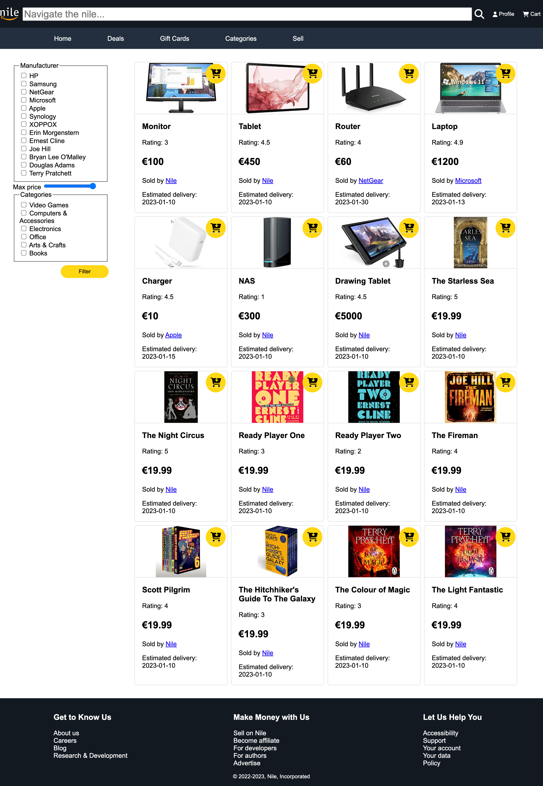
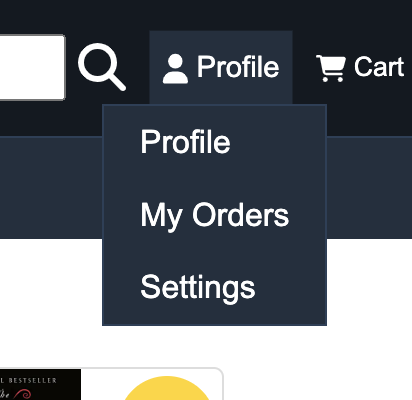
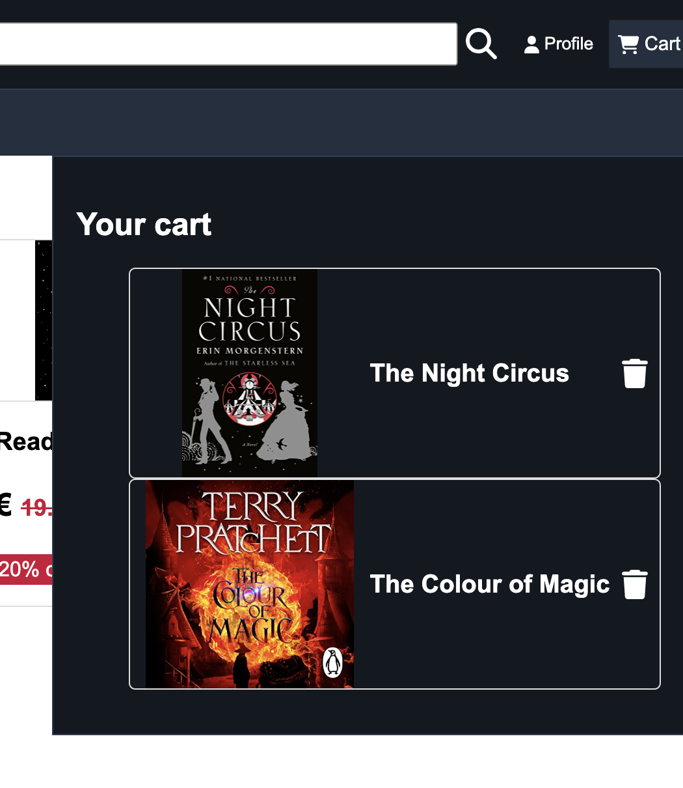
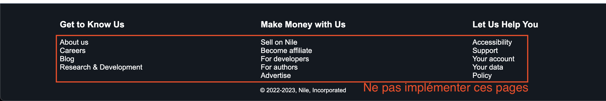

# Nile

## Le projet

Ceci est le projet d'évaluation du cours d'accessibilité du web pour les MTI 2023. Ce projet se fait en groupes de 3 à 4
personnes. Le but sera d'implémenter les deux pages présentées dans [les maquettes](#les-maquettes) dans le framework
web de votre choix.

## Les maquettes

### Page d'accueil

### Page de recherche


### Détail des interactions

- Clicker sur le logo en haut à gauche revient sur la page d'accueil
- Entrer du texte dans le champ "Navigate the nile..." et clicker sur la loupe redirige vers la page de recherche (
  cf. [seconde maquette](#page-de-recherche))
- Clicker sur "Profile" ou l'icône associée ouvre un sous-menu
  - Les pages "Profile", "My Orders" et "Settings" ne sont pas à implémenter

- Clicker sur "Cart" ou l'icône associée ouvre un sous-menu
  - Clicker n'importe où dans une card redirige vers la fiche du produit (page qui n'est pas à implémenter)
  - Clicker sur la poubelle supprime le produit du panier

- Les pages "Deals", "Gift Cards", "Categories" et "Sell" ne sont pas à implémenter
- Les cards de produit sont entièrement clickable et ouvre le détail du produit (page qui n'est pas à implémenter)
  - Clicker sur le bouton en jaune ajoute le produit au panier
- Les cards de catégories sont entièrement clickable et redirigent vers la page de recherche avec le filtre sur la catégorie déjà set.
- Aucune des pages dans les sections "Get to Know Us", "Make Money with Us" et "Let Us Help You" ne sont à implémenter


#### Page de recherche

- Clicker n'import où sur une card renvoi vers la page du produit
    - Mais clicker sur le nom du vendeur renvoi vers la page du vendeur
    - Les pages de détail de produit et de vendeur ne sont pas à implémenter
- Clicker sur "Filter" filtre la liste des produits.

## Le dépôt

Vous trouverez dans ce dépôt plusieurs dossiers :

```shell
.
├ assets/
│ ├ *.svg         # Les assets statiques
│ └ data.json     # Les données utilisée pour générer les maquettes
│
├ screenshots/
│ └ *.png         # Les screenshots utilisées dans ce document
│
├ src/
│ ├ cart.js       # Export des fonctions utilisée pour gérer le panier (cf. [Gestion du panier](#gestion-du-panier))
│ └ style.css     # Les couleurs et la police utilisés
│
└ README.md
```

Notez que les images des produits et des catégories se trouvent sous la forme d'URLs dans les données
(fichier `./assets/data.json`).

### Gestion du panier

Le fichier `./src/cart.js` exporte 4 fonctions :

```js
// Récupérer le contenu du panier au format `["Laptop", "Tablet", ...]`
function retrieveCart();

// Ajouter un item au panier `addToCart("Laptop")`
function addToCart(itemName);

// Supprimer un item du panier `["Laptop"] ==> removeFromCart("Laptop") ==> []`
function removeFromCart(itemName);

// Vider entièrement le panier `clearCart()`
function clearCart();
```

Vous êtes libre de modifier ces fonctions pour vos besoins et façons de faire.

### Couleurs et police

Vous trouverez les différentes couleurs ainsi que la police utilisée dans le fichier `./src/style.css`.
Les couleurs sont définies en [_Custom Properties_](https://developer.mozilla.org/en-US/docs/Web/CSS/--*).
e.g. :
```css
.mon-truc-avec-couleur-primaire {
  background-color: var(--color-primary);
  color: var(--color-primary-text);
  border: 1px solid var(--color-accent);
}
```
La police est set par défaut sur tout le document et devrait être appliquée dès que vous importerez le fichier `style.css`.

## Travail à faire

**Dans le framework web de votre choix** (React, VueJS, Angular, Django, ...), implémenter les pages présentées dans [les maquettes](#les-maquettes).

Tous les bonus sont bienvenus (tant qu'ils ont un lien avec l'accessibilité), qu'ils soient techniques ou fonctionnels !
Par exemple, vous pourriez :
  - Implémenter des liens d'évitement (_Skip links_ en anglais)
  - Implémenter des pages optionnelles (détail d'un produit, détail du panier, ...)
  - Ajouter des fonctionnalités sur les pages existantes
  - Implémenter des tests automatiques d'accessibilité
    - cf. [@testing-library/react](https://testing-library.com/docs/react-testing-library/intro/), [@testing-library/vue](https://testing-library.com/docs/vue-testing-library/intro/), [Google Lighthouse](https://github.com/GoogleChrome/lighthouse-ci), ...
  - ...

Vous êtes complètement libres du détail d'implémentation, vous pouvez modifier les fichiers donnés, utiliser les bibliothèques de votre choix, ... .

**Vous pouvez utiliser des `<div>` et `<span>` mais attention à la sémantique !**

## Rendu

Par groupe :
1) [Fork le repo sur GitLab](https://gitlab.cri.epita.fr/gauthier.fiorentino/mti2023-a11y-nile/-/forks/new)
    - **Préfixer le *slug*** du repo par `mti-2023-a11y`
2) Inviter chacun des membres du groupe
3) Inviter @gauthier.fiorentino **avec le role *"Maintainer"*** (*Project Information > Members*)
4) Ajouter à ce README.md la liste des bonus réalisés

Le but de cet exercice n'est pas de faire du "_pixel perfect_",
il n'est pas nécessaire de reproduire à l'identique la maquette (les espacements, ...)
mais tout changement majeur doit être justifié d'un point de vue accessibilité (changer une couleur, la mise en page, ...).

**Deadline :** Vendredi 6 janvier 18h30 (heure de début des soutenances)
